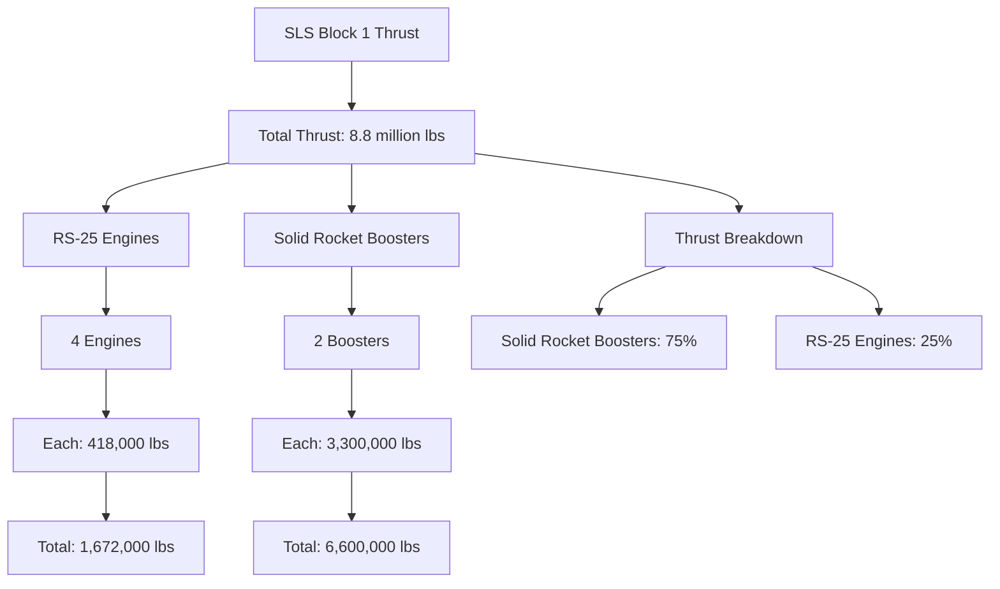

# Artemis II — Diagram
*Generated: 2026-04-16 16:09:09*
*Question: Compare the thrust of SLS engines and solid rocket boosters*

---

```mermaid
flowchart TD
    A[SLS Block 1 Thrust] --> B[Total Thrust: 8.8 million lbs]
    B --> C[RS-25 Engines]
    C --> D[4 Engines]
    D --> E[Each: 418,000 lbs]
    E --> F[Total: 1,672,000 lbs]
    B --> G[Solid Rocket Boosters]
    G --> H[2 Boosters]
    H --> I[Each: 3,300,000 lbs]
    I --> J[Total: 6,600,000 lbs]
    B --> K[Thrust Breakdown]
    K --> L[Solid Rocket Boosters: 75%]
    K --> M[RS-25 Engines: 25%]
```

---
*Render at: https://mermaid.live  — paste the code above*
